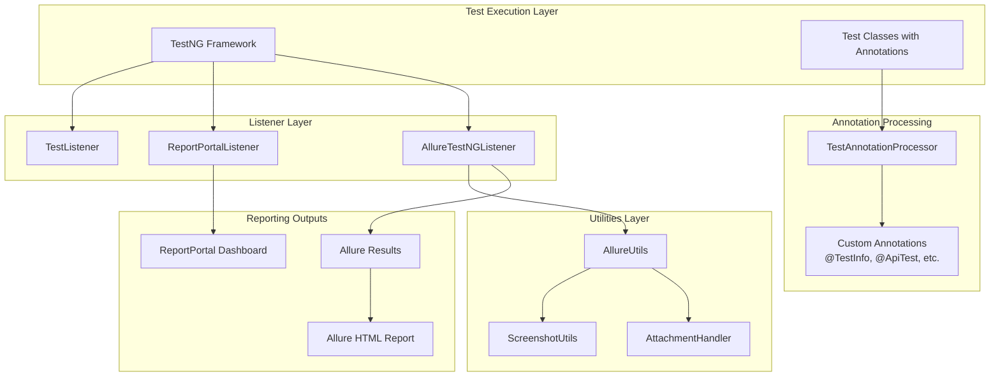
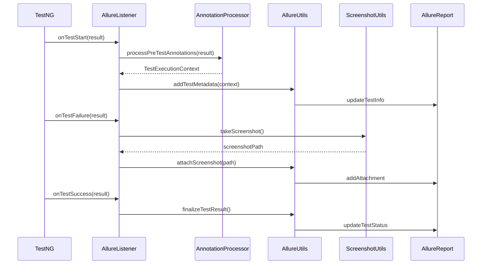

# Allure Reporting Integration Design

## Overview

This design document outlines the integration of Allure TestNG reporting into the existing Playwright Java testing framework. The integration will complement the existing ReportPortal integration by providing rich, interactive HTML reports with detailed test execution insights, attachments, and comprehensive test analytics.

### Project Context
The current framework already includes:
- Playwright for browser automation
- TestNG as the testing framework
- ReportPortal integration for real-time reporting
- Custom annotation system (@TestInfo, @ApiTest, @PerformanceTest, @SecurityTest, @TestCategory)
- Screenshot capture utilities
- Custom listeners (TestListener, ReportPortalListener)

### Integration Goals
- Add Allure TestNG integration alongside existing ReportPortal functionality
- Leverage existing annotation system for enhanced Allure reports
- Maintain backward compatibility with current test structure
- Provide rich HTML reports with screenshots, attachments, and test analytics
- Support parallel execution and thread-safe reporting

## Technology Stack & Dependencies

### Core Dependencies
```xml
<!-- Allure TestNG Integration -->
<dependency>
    <groupId>io.qameta.allure</groupId>
    <artifactId>allure-testng</artifactId>
    <version>2.29.0</version>
</dependency>

<!-- Allure Java Commons -->
<dependency>
    <groupId>io.qameta.allure</groupId>
    <artifactId>allure-java-commons</artifactId>
    <version>2.29.0</version>
</dependency>

<!-- Allure Attachments -->
<dependency>
    <groupId>io.qameta.allure</groupId>
    <artifactId>allure-attachments</artifactId>
    <version>2.29.0</version>
</dependency>
```

### Maven Plugin Configuration
```xml
<plugin>
    <groupId>io.qameta.allure</groupId>
    <artifactId>allure-maven</artifactId>
    <version>2.12.0</version>
    <configuration>
        <reportVersion>2.29.0</reportVersion>
        <resultsDirectory>${project.build.directory}/allure-results</resultsDirectory>
        <reportDirectory>${project.build.directory}/allure-report</reportDirectory>
    </configuration>
</plugin>
```

## Architecture

### Component Integration Overview



### Enhanced Listener Architecture



## Implementation Components

### 1. AllureTestNGListener Extension

```java
// Enhanced Allure Listener Implementation
public class AllureTestNGEnhancedListener extends AllureTestNg {
    private static final Logger logger = LogManager.getLogger();
    private AllureUtils allureUtils;
    
    public AllureTestNGEnhancedListener() {
        super();
        this.allureUtils = new AllureUtils();
    }
    
    @Override
    public void onTestStart(ITestResult result) {
        super.onTestStart(result);
        
        // Process custom annotations and add to Allure
        TestAnnotationProcessor.TestExecutionContext context = 
            TestAnnotationProcessor.processPreTestAnnotations(result);
        
        if (context != null) {
            allureUtils.enrichTestWithMetadata(context);
        }
    }
    
    @Override
    public void onTestFailure(ITestResult result) {
        // Attach screenshot before calling super
        allureUtils.attachScreenshotOnFailure(result);
        super.onTestFailure(result);
    }
}
```

### 2. AllureUtils Utility Class

```java
public class AllureUtils {
    
    public void enrichTestWithMetadata(TestExecutionContext context) {
        // Add test information from @TestInfo
        if (context.hasTestInfo()) {
            TestInfo info = context.getTestInfo();
            Allure.epic(info.epic());
            Allure.feature(info.feature());
            Allure.story(info.story());
            Allure.description(info.description());
            Allure.severity(mapPriorityToSeverity(info.priority()));
            
            // Add JIRA link if present
            if (!info.jiraId().isEmpty()) {
                Allure.link("JIRA", info.jiraId(), getJiraUrl(info.jiraId()));
            }
            
            // Add tags as labels
            for (String tag : info.tags()) {
                Allure.label("tag", tag);
            }
        }
        
        // Add API test metadata from @ApiTest
        if (context.hasApiTest()) {
            ApiTest apiTest = context.getApiTest();
            Allure.label("api.endpoint", apiTest.endpoint());
            Allure.label("api.method", apiTest.method());
            Allure.parameter("Authentication Required", apiTest.requiresAuth());
        }
        
        // Add performance test metadata
        if (context.hasPerformanceTest()) {
            PerformanceTest perfTest = context.getPerformanceTest();
            Allure.label("test.type", "performance");
            Allure.parameter("Max Response Time", perfTest.maxResponseTime() + "ms");
            Allure.parameter("Concurrent Users", perfTest.concurrentUsers());
        }
        
        // Add security test metadata
        if (context.hasSecurityTest()) {
            SecurityTest secTest = context.getSecurityTest();
            Allure.label("test.type", "security");
            Allure.label("security.level", secTest.level().name());
            for (SecurityType type : secTest.types()) {
                Allure.label("security.type", type.name());
            }
        }
        
        // Add test category metadata
        if (context.hasTestCategory()) {
            TestCategory category = context.getTestCategory();
            Allure.label("test.category", category.value().name());
            Allure.label("test.level", category.level().name());
            Allure.label("risk.level", category.riskLevel().name());
            
            if (category.isFlaky()) {
                Allure.label("flaky", "true");
            }
        }
    }
    
    public void attachScreenshotOnFailure(ITestResult result) {
        try {
            ScreenshotUtils screenshotUtils = new ScreenshotUtils();
            String screenshotPath = screenshotUtils.takeScreenshot(
                result.getMethod().getMethodName() + "_failure");
            
            if (screenshotPath != null) {
                byte[] screenshot = Files.readAllBytes(Paths.get(screenshotPath));
                Allure.addAttachment("Screenshot on Failure", "image/png", 
                    new ByteArrayInputStream(screenshot), ".png");
            }
        } catch (Exception e) {
            logger.error("Failed to attach screenshot to Allure: {}", e.getMessage());
        }
    }
    
    private SeverityLevel mapPriorityToSeverity(TestPriority priority) {
        return switch (priority) {
            case CRITICAL -> SeverityLevel.BLOCKER;
            case HIGH -> SeverityLevel.CRITICAL;
            case MEDIUM -> SeverityLevel.NORMAL;
            case LOW -> SeverityLevel.MINOR;
            default -> SeverityLevel.NORMAL;
        };
    }
}
```

### 3. Enhanced Custom Annotations

#### Updated @TestInfo Annotation
```java
@Retention(RetentionPolicy.RUNTIME)
@Target(ElementType.METHOD)
public @interface TestInfo {
    String description() default "";
    String author() default "";
    TestPriority priority() default TestPriority.MEDIUM;
    String jiraId() default "";
    String[] tags() default {};
    String[] requirements() default {};
    int estimatedDuration() default 0;
    boolean isBlocking() default false;
    
    // Allure-specific fields
    String epic() default "";
    String feature() default "";
    String story() default "";
}
```

### 4. Allure Configuration

#### allure.properties Configuration
```properties
# Allure Configuration
allure.results.directory=target/allure-results
allure.link.issue.pattern=https://your-jira-instance.com/browse/{}
allure.link.tms.pattern=https://your-jira-instance.com/browse/{}

# Environment Configuration
allure.environment.browser=${browser.name:chrome}
allure.environment.base.url=${base.url:http://localhost:8080}
allure.environment.test.environment=${test.environment:local}
allure.environment.java.version=${java.version}
```

#### Environment Properties Generator
```java
public class AllureEnvironmentWriter {
    
    public static void writeEnvironmentProperties() {
        try {
            Properties props = new Properties();
            props.setProperty("Browser", System.getProperty("browser.name", "chrome"));
            props.setProperty("Base URL", System.getProperty("base.url", "http://localhost:8080"));
            props.setProperty("Test Environment", System.getProperty("test.environment", "local"));
            props.setProperty("Java Version", System.getProperty("java.version"));
            props.setProperty("Framework Version", "1.0-SNAPSHOT");
            props.setProperty("Playwright Version", "1.54.0");
            
            File resultsDir = new File("target/allure-results");
            if (!resultsDir.exists()) {
                resultsDir.mkdirs();
            }
            
            try (FileWriter writer = new FileWriter(new File(resultsDir, "environment.properties"))) {
                props.store(writer, "Test Environment Information");
            }
        } catch (IOException e) {
            logger.error("Failed to write environment properties: {}", e.getMessage());
        }
    }
}
```

## TestNG Configuration

### Multiple Listener Registration
```xml
<suite name="Allure Test Suite" parallel="methods" thread-count="4">
    <listeners>
        <listener class-name="com.starlettech.listeners.TestListener"/>
        <listener class-name="com.starlettech.listeners.ReportPortalListener"/>
        <listener class-name="com.starlettech.listeners.AllureTestNGEnhancedListener"/>
    </listeners>
    
    <test name="UI Tests">
        <classes>
            <class name="starlettech.tests.ui.LoginTest"/>
            <class name="starlettech.tests.ui.ProductTest"/>
        </classes>
    </test>
    
    <test name="API Tests">
        <classes>
            <class name="starlettech.tests.api.UserApiTest"/>
            <class name="starlettech.tests.api.AuthApiTest"/>
        </classes>
    </test>
</suite>
```

### Maven Surefire Plugin Configuration
```xml
<plugin>
    <groupId>org.apache.maven.plugins</groupId>
    <artifactId>maven-surefire-plugin</artifactId>
    <version>3.5.2</version>
    <configuration>
        <suiteXmlFiles>
            <suiteXmlFile>src/test/resources/testng.xml</suiteXmlFile>
        </suiteXmlFiles>
        <argLine>
            -javaagent:"${settings.localRepository}/org/aspectj/aspectjweaver/1.9.22.1/aspectjweaver-1.9.22.1.jar"
        </argLine>
        <systemPropertyVariables>
            <allure.results.directory>${project.build.directory}/allure-results</allure.results.directory>
        </systemPropertyVariables>
    </configuration>
    <dependencies>
        <dependency>
            <groupId>org.aspectj</groupId>
            <artifactId>aspectjweaver</artifactId>
            <version>1.9.22.1</version>
        </dependency>
    </dependencies>
</plugin>
```

## Report Generation & Execution

### Maven Commands
```bash
# Run tests and generate Allure results
mvn clean test

# Generate Allure report
mvn allure:report

# Serve Allure report locally
mvn allure:serve

# Generate and open report in one command
mvn clean test allure:report allure:serve
```

### CI/CD Integration Commands
```bash
# For Jenkins/GitHub Actions
mvn clean test
mvn allure:report

# Archive allure-report directory as artifacts
# Publish HTML reports from target/allure-report
```

### Docker Integration
```dockerfile
# Add Allure CLI to existing Dockerfile
FROM openjdk:21-jdk

# Install Allure CLI
RUN curl -o allure-2.29.0.tgz -Ls https://github.com/allure-framework/allure2/releases/download/2.29.0/allure-2.29.0.tgz \
    && tar -zxvf allure-2.29.0.tgz -C /opt/ \
    && ln -s /opt/allure-2.29.0/bin/allure /usr/bin/allure

# Copy project and run tests
COPY . /app
WORKDIR /app

# Run tests and generate report
RUN mvn clean test allure:report
```

## Advanced Features Integration

### 1. Step Annotations for Detailed Reporting
```java
public class LoginSteps {
    
    @Step("Navigate to login page")
    public void navigateToLoginPage() {
        // Implementation with Allure step tracking
        Allure.step("Opening login page", () -> {
            page.navigate("/login");
        });
    }
    
    @Step("Enter credentials: username={username}")
    public void enterCredentials(String username, String password) {
        Allure.parameter("username", username);
        Allure.parameter("password", "***"); // Hide sensitive data
        
        page.fill("#username", username);
        page.fill("#password", password);
    }
    
    @Step("Verify successful login")
    public void verifySuccessfulLogin() {
        Allure.step("Checking for dashboard elements", () -> {
            assertThat(page.locator(".dashboard")).isVisible();
        });
    }
}
```

### 2. API Test Integration with Request/Response Logging
```java
@ApiTest(endpoint = "/api/users", method = "POST")
public void createUserTest() {
    String requestBody = "{'name': 'John', 'email': 'john@example.com'}";
    
    // Attach request
    Allure.addAttachment("Request Body", "application/json", 
        requestBody, ".json");
    
    Response response = apiClient.post("/api/users", requestBody);
    
    // Attach response
    Allure.addAttachment("Response Body", "application/json", 
        response.getBody(), ".json");
    
    // Add response details as parameters
    Allure.parameter("Status Code", response.getStatusCode());
    Allure.parameter("Response Time", response.getTime() + "ms");
}
```

### 3. Performance Test Integration
```java
@PerformanceTest(maxResponseTime = 2000, concurrentUsers = 10)
public void performanceApiTest() {
    long startTime = System.currentTimeMillis();
    
    // Test execution
    Response response = apiClient.get("/api/performance-endpoint");
    
    long responseTime = System.currentTimeMillis() - startTime;
    
    // Add performance metrics to Allure
    Allure.parameter("Response Time", responseTime + "ms");
    Allure.parameter("Status Code", response.getStatusCode());
    
    if (responseTime > 2000) {
        Allure.step("Performance violation detected: " + responseTime + "ms > 2000ms");
    }
}
```

## Parallel Execution Support

### Thread-Safe Configuration
```java
public class AllureThreadSafeUtils {
    
    private static final ThreadLocal<AllureLifecycle> LIFECYCLE = 
        ThreadLocal.withInitial(() -> Allure.getLifecycle());
    
    public static void setTestExecutionContext(TestExecutionContext context) {
        // Thread-safe context management for parallel execution
        AllureLifecycle lifecycle = LIFECYCLE.get();
        // Implementation for thread-safe metadata setting
    }
    
    public static void attachScreenshotSafely(String name, byte[] screenshot) {
        try {
            LIFECYCLE.get().addAttachment(name, "image/png", "png", screenshot);
        } catch (Exception e) {
            logger.error("Failed to attach screenshot safely: {}", e.getMessage());
        }
    }
}
```

## Reporting Benefits & Features

### 1. Enhanced Test Traceability
- JIRA integration through custom annotations
- Epic/Feature/Story organization
- Tag-based test categorization
- Requirements linking

### 2. Rich Attachments
- Automatic screenshot capture on failures
- API request/response logging
- Performance metrics visualization
- Log file attachments

### 3. Test Analytics
- Historical trend analysis
- Flaky test identification
- Performance metrics tracking
- Environment comparison

### 4. Detailed Test Information
- Custom annotation metadata display
- Test execution timeline
- Parallel execution visualization
- Retry attempt tracking

## Migration Strategy

### Phase 1: Dependencies & Basic Setup
1. Add Allure dependencies to pom.xml
2. Configure Allure Maven plugin
3. Create basic AllureTestNGEnhancedListener

### Phase 2: Integration with Existing System
1. Integrate with existing TestAnnotationProcessor
2. Update custom annotations for Allure compatibility
3. Enhance ScreenshotUtils for Allure attachments

### Phase 3: Advanced Features
1. Implement step annotations
2. Add API request/response logging
3. Integrate performance metrics
4. Add environment configuration

### Phase 4: CI/CD Integration
1. Update build scripts for report generation
2. Configure artifact archiving
3. Set up report publishing

## Best Practices

### 1. Annotation Usage
- Use @TestInfo with epic/feature/story for proper organization
- Always include meaningful descriptions
- Tag tests appropriately for filtering
- Link to JIRA tickets where applicable

### 2. Attachment Management
- Attach screenshots only on failures to reduce report size
- Use appropriate MIME types for attachments
- Limit attachment sizes in CI environments

### 3. Parallel Execution
- Ensure thread-safe attachment handling
- Use ThreadLocal for context management
- Avoid shared mutable state in listeners

### 4. Performance Considerations
- Monitor report generation time with large test suites
- Use appropriate retention policies for historical data
- Optimize attachment sizes and formats