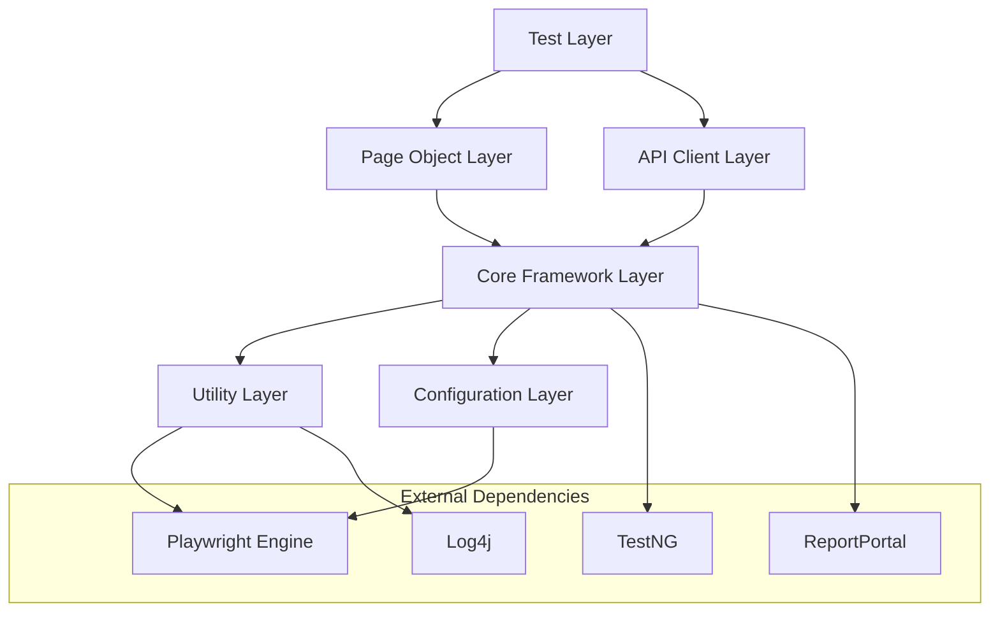
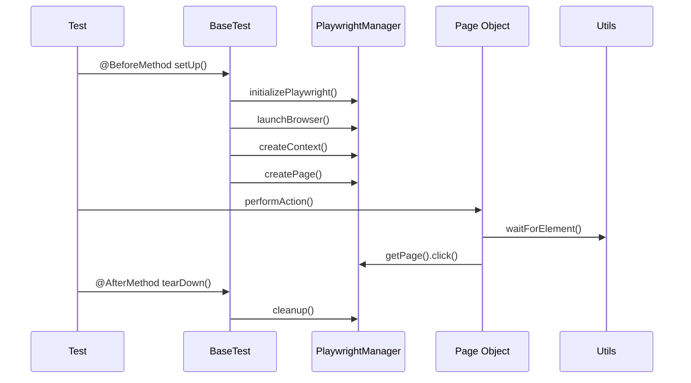
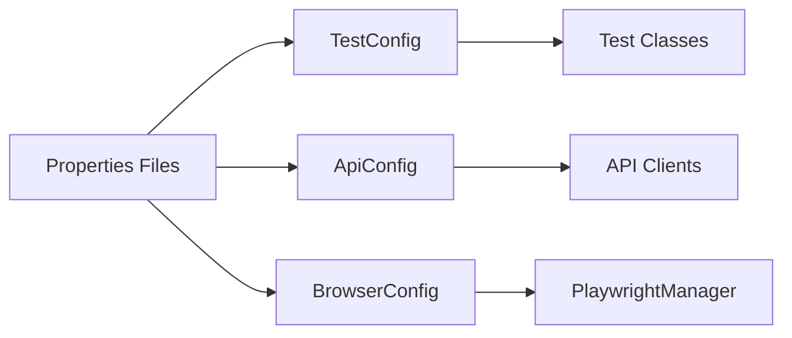

# Playwright Test Otomasyon Framework'ü - Mimari Dokümantasyon

## 📋 İçindekiler
- [Genel Mimari](#genel-mimari)
- [Katmanlı Yapı](#katmanlı-yapı)
- [Çekirdek Bileşenler](#çekirdek-bileşenler)
- [Tasarım Desenleri](#tasarım-desenleri)
- [Modül Etkileşimleri](#modül-etkileşimleri)
- [Thread Safety](#thread-safety)

## Genel Mimari

Framework, katmanlı mimari prensiplerine dayalı olarak tasarlanmıştır. Her katman belirli sorumlulukları üstlenir ve diğer katmanlarla tanımlanmış arayüzler üzerinden iletişim kurar.



## Katmanlı Yapı

### 1. Test Katmanı (Test Layer)
**Konum**: `src/test/java/starlettech/tests/`

Test senaryolarının bulunduğu en üst katmandır. Bu katman:
- UI testleri (`ui/` paketi)
- API testleri (`api/` paketi)  
- Hibrit testleri (`hybrid/` paketi)

**Sorumluluklar**:
- Test senaryolarının tanımlanması
- Test verilerinin yönetimi
- Assertion'ların gerçekleştirilmesi
- Test akışının kontrolü

### 2. Page Object Katmanı
**Konum**: `src/test/java/starlettech/pages/`

Page Object Model deseninin uygulandığı katmandır.

**Temel Sınıflar**:
- `LoginPage`: Giriş sayfası işlemleri
- `HomePage`: Ana sayfa işlemleri
- `BasePage`: Ortak sayfa işlemleri

**Sorumluluklar**:
- Sayfa elementlerinin tanımlanması
- Sayfa işlemlerinin kapsüllenmesi
- Element etkileşimlerinin yönetimi

### 3. API Client Katmanı
**Konum**: `src/test/java/starlettech/api/`

API testleri için client sınıflarının bulunduğu katmandır.

**Alt Bileşenler**:
- `clients/`: API client sınıfları
- `models/`: Veri modelleri
- `responses/`: Response wrapper sınıfları

### 4. Çekirdek Framework Katmanı
**Konum**: `src/main/java/com/starlettech/core/`

Framework'ün temel işlevselliğini sağlayan katmandır.

**Ana Sınıflar**:
- `PlaywrightManager`: Playwright yaşam döngüsü yönetimi
- `BaseTest`: UI testleri için temel sınıf
- `BaseApiTest`: API testleri için temel sınıf
- `BasePage`: Sayfa işlemleri için temel sınıf

## Çekirdek Bileşenler

### PlaywrightManager
```java
public class PlaywrightManager {
    private static ThreadLocal<Playwright> playwrightThreadLocal = new ThreadLocal<>();
    private static ThreadLocal<Browser> browserThreadLocal = new ThreadLocal<>();
    private static ThreadLocal<BrowserContext> contextThreadLocal = new ThreadLocal<>();
    private static ThreadLocal<Page> pageThreadLocal = new ThreadLocal<>();
}
```

**Sorumluluklar**:
- Playwright instance'larının yaşam döngüsü yönetimi
- Thread-safe browser yönetimi
- Context ve page oluşturma
- Kaynak temizleme

### BaseTest Sınıfı
```java
public abstract class BaseTest {
    @BeforeMethod
    public void setUp(Method method) {
        // Test kurulumu
        PlaywrightManager.initializePlaywright();
        PlaywrightManager.launchBrowser();
        PlaywrightManager.createContext();
        PlaywrightManager.createPage();
    }
    
    @AfterMethod
    public void tearDown(ITestResult result) {
        // Test temizleme
        if (result.getStatus() == ITestResult.FAILURE) {
            ScreenshotUtils.takeScreenshot();
        }
        PlaywrightManager.cleanup();
    }
}
```

### BasePage Sınıfı
```java
public abstract class BasePage {
    protected Page page;
    protected TestConfig testConfig;
    protected WaitUtils waitUtils;
    
    public BasePage() {
        this.page = PlaywrightManager.getPage();
        this.testConfig = TestConfig.getInstance();
        this.waitUtils = new WaitUtils(page);
    }
}
```

## Tasarım Desenleri

### 1. Singleton Pattern
**Kullanım Alanları**:
- `TestConfig`: Konfigürasyon yönetimi
- `ApiConfig`: API konfigürasyonu
- `TestDataReader`: Test verisi okuma

**Örnek Implementasyon**:
```java
public class TestConfig {
    private static TestConfig instance;
    
    private TestConfig() {}
    
    public static TestConfig getInstance() {
        if (instance == null) {
            synchronized (TestConfig.class) {
                if (instance == null) {
                    instance = new TestConfig();
                }
            }
        }
        return instance;
    }
}
```

### 2. Page Object Model
**Avantajları**:
- Kod tekrarının azaltılması
- Bakım kolaylığı
- Element değişikliklerinin tek noktadan yönetimi

**Implementasyon**:
```java
public class LoginPage extends BasePage {
    private static final String USERNAME_INPUT = "#username";
    private static final String PASSWORD_INPUT = "#password";
    
    public void login(String username, String password) {
        type(USERNAME_INPUT, username);
        type(PASSWORD_INPUT, password);
        click(LOGIN_BUTTON);
    }
}
```

### 3. Factory Pattern
**Kullanım**: Browser oluşturma işlemlerinde

```java
private static Browser createBrowser(Playwright playwright, BrowserType browserType) {
    return switch (browserType.getBrowserName().toLowerCase()) {
        case "chromium" -> playwright.chromium().launch(launchOptions);
        case "firefox" -> playwright.firefox().launch(launchOptions);
        case "webkit" -> playwright.webkit().launch(launchOptions);
        default -> throw new IllegalArgumentException("Unsupported browser: " + browserType);
    };
}
```

### 4. Builder Pattern
**Kullanım**: Konfigürasyon nesnelerinin oluşturulmasında

### 5. Observer Pattern
**Kullanım**: TestNG listener'ları ile test yaşam döngüsü takibi

## Modül Etkileşimleri

### Test Yürütme Akışı



### Konfigürasyon Yönetimi



## Thread Safety

Framework, paralel test yürütmeyi desteklemek için thread-safe tasarlanmıştır.

### ThreadLocal Kullanımı

```java
public class PlaywrightManager {
    private static ThreadLocal<Playwright> playwrightThreadLocal = new ThreadLocal<>();
    private static ThreadLocal<Browser> browserThreadLocal = new ThreadLocal<>();
    private static ThreadLocal<BrowserContext> contextThreadLocal = new ThreadLocal<>();
    private static ThreadLocal<Page> pageThreadLocal = new ThreadLocal<>();
}
```

### Thread Safety Garantileri

1. **Playwright Resources**: Her thread kendi Playwright instance'ına sahiptir
2. **Configuration**: Singleton sınıflar thread-safe implementasyona sahiptir
3. **Test Data**: Her test kendi test verilerine erişir
4. **Logging**: Log4j thread-safe loglama sağlar

### Paralel Yürütme Konfigürasyonu

```xml
<suite name="Parallel Tests" parallel="methods" thread-count="3">
    <test name="UI Tests">
        <classes>
            <class name="starlettech.tests.ui.LoginTests"/>
        </classes>
    </test>
</suite>
```

## Bağımlılık Yönetimi

### Maven Bağımlılıkları

Framework'ün temel bağımlılıkları:

```xml
<dependencies>
    <!-- Playwright -->
    <dependency>
        <groupId>com.microsoft.playwright</groupId>
        <artifactId>playwright</artifactId>
        <version>1.54.0</version>
    </dependency>
    
    <!-- TestNG -->
    <dependency>
        <groupId>org.testng</groupId>
        <artifactId>testng</artifactId>
        <version>7.11.0</version>
    </dependency>
    
    <!-- ReportPortal -->
    <dependency>
        <groupId>com.epam.reportportal</groupId>
        <artifactId>agent-java-testng</artifactId>
        <version>5.5.0</version>
    </dependency>
</dependencies>
```

### Bağımlılık Enjeksiyonu

Framework, constructor injection kullanarak bağımlılıkları yönetir:

```java
public class BasePage {
    protected Page page;
    protected TestConfig testConfig;
    protected WaitUtils waitUtils;
    
    public BasePage() {
        this.page = PlaywrightManager.getPage();
        this.testConfig = TestConfig.getInstance();
        this.waitUtils = new WaitUtils(page);
    }
}
```

## Genişletilebilirlik

Framework, yeni özellikler eklemek için esnek bir yapıya sahiptir:

### Yeni Page Object Ekleme
1. `BasePage` sınıfından türetme
2. Sayfa elementlerini tanımlama
3. Sayfa işlemlerini implementasyon

### Yeni Utility Ekleme
1. `utils` paketine yeni sınıf ekleme
2. Static method'lar ile işlevsellik sağlama
3. Loglama ve hata yönetimi ekleme

### Yeni Test Türü Ekleme
1. Uygun base sınıftan türetme
2. Test grupları tanımlama
3. Suite konfigürasyonu ekleme

---

**Sonraki Bölüm**: [Kurulum ve Konfigürasyon](03-kurulum-konfigurasyon.md)
