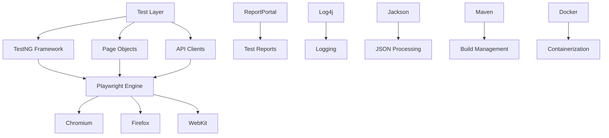

# Playwright Test Otomasyon Framework'ü - Ana Dokümantasyon

## 🎯 Hoş Geldiniz

Playwright Test Otomasyon Framework'ü dokümantasyonuna hoş geldiniz! Bu framework, Java, TestNG ve Microsoft Playwright kullanarak geliştirilmiş kapsamlı bir test otomasyon çözümüdür.

## 🚀 Hızlı Başlangıç

### 5 Dakikada Framework'ü Çalıştırın

```bash
# 1. Projeyi klonlayın
git clone <repository-url>
cd core-playwright

# 2. Bağımlılıkları yükleyin
mvn clean install

# 3. Playwright browser'larını yükleyin
mvn exec:java -e -D exec.mainClass=com.microsoft.playwright.CLI -D exec.args="install"

# 4. Smoke testlerini çalıştırın
mvn test -Dgroups=smoke
```

### İlk Testinizi Yazın

```java
@Test(groups = {"smoke", "ui"})
public void testBasicLogin() {
    LoginPage loginPage = new LoginPage();
    HomePage homePage = new HomePage();
    
    loginPage.navigateToLoginPage();
    loginPage.login("testuser1", "password123");
    
    Assert.assertTrue(homePage.isUserLoggedIn());
}
```

## 📚 Dokümantasyon Haritası

### 🎯 Temel Bilgiler
| Dokümantasyon | Açıklama | Hedef Kitle | Süre |
|---------------|----------|-------------|------|
| **[📖 Proje Genel Bakış](01-proje-genel-bakis.md)** | Framework'ün amacı, teknoloji yığını ve temel özellikler | Herkes | 15 dk |
| **[⚙️ Kurulum ve Konfigürasyon](03-kurulum-konfigurasyon.md)** | Adım adım kurulum rehberi ve ortam ayarları | Yeni Başlayanlar | 30 dk |

### 🏗️ Teknik Detaylar
| Dokümantasyon | Açıklama | Hedef Kitle | Süre |
|---------------|----------|-------------|------|
| **[🏛️ Mimari Dokümantasyon](02-mimari-dokumantasyon.md)** | Framework mimarisi, tasarım desenleri ve bileşenler | Geliştiriciler | 45 dk |
| **[📋 API Referansı](06-api-referansi.md)** | Sınıflar, methodlar ve kullanım örnekleri | Geliştiriciler | 40 dk |

### 💡 Pratik Rehberler
| Dokümantasyon | Açıklama | Hedef Kitle | Süre |
|---------------|----------|-------------|------|
| **[📝 Kullanım Kılavuzu](04-kullanim-kilavuzu.md)** | Test yazma, çalıştırma ve raporlama | Test Geliştiricileri | 60 dk |
| **[✨ En İyi Uygulamalar](05-en-iyi-uygulamalar.md)** | Kodlama standartları ve optimizasyon teknikleri | Senior Geliştiriciler | 50 dk |
| **[🔧 Sorun Giderme](07-sorun-giderme.md)** | Yaygın sorunlar ve çözüm yöntemleri | Herkes | 35 dk |

## 🎭 Framework Özellikleri

### ✅ UI Test Yetenekleri
- **Çoklu Browser Desteği**: Chromium, Firefox, Safari (WebKit)
- **Paralel Test Yürütme**: Thread-safe tasarım ile yüksek performans
- **Page Object Model**: Sürdürülebilir test yapısı
- **Akıllı Wait Stratejileri**: Kararlı element bulma
- **Otomatik Screenshot**: Hata durumlarında görsel kanıt

### 🔌 API Test Yetenekleri
- **RESTful API Desteği**: Kapsamlı HTTP method desteği
- **Otomatik Authentication**: Token tabanlı kimlik doğrulama
- **JSON Schema Validation**: Request/response doğrulama
- **Retry Mekanizması**: Hatalı istekler için otomatik tekrar
- **Detaylı API Logging**: Request/response izleme

### 📊 Raporlama ve İzleme
- **ReportPortal Entegrasyonu**: Gelişmiş web tabanlı raporlama
- **TestNG Reports**: Yerleşik HTML raporları
- **Video Kayıt**: Test yürütme sürecinin kaydı
- **Trace Kayıt**: Detaylı debug bilgileri
- **Custom Metrics**: Test performans metrikleri

## 🛠️ Teknoloji Yığını



## 📈 Framework Metrikleri

### 📊 Performans Göstergeleri
| Metrik | Değer | Açıklama |
|--------|-------|----------|
| **Test Yürütme Hızı** | ~2 saniye/test | Ortalama UI test süresi |
| **API Test Hızı** | ~500ms/test | Ortalama API test süresi |
| **Paralel Kapasitesi** | 5 thread | Eşzamanlı test sayısı |
| **Browser Başlatma** | ~3 saniye | İlk browser açılış süresi |
| **Memory Kullanımı** | ~512MB | Ortalama RAM tüketimi |

### 🎯 Test Kapsamı
| Test Türü | Sayı | Kapsam |
|-----------|------|--------|
| **UI Testleri** | 25+ | Login, Navigation, Forms |
| **API Testleri** | 30+ | CRUD Operations, Auth |
| **Hibrit Testleri** | 10+ | UI-API Entegrasyonu |
| **Smoke Testleri** | 15+ | Kritik İşlevsellik |

## 🎯 Kullanım Senaryoları

### 🏢 Kurumsal Projeler
- **Büyük Ölçekli Web Uygulamaları**: E-ticaret, Banking, SaaS
- **Mikroservis Mimarileri**: API-first yaklaşım
- **CI/CD Pipeline Entegrasyonu**: Jenkins, GitLab CI, Azure DevOps
- **Çoklu Ortam Desteği**: Dev, Test, Staging, Production

### 🚀 Agile/DevOps Süreçleri
- **Sprint Testleri**: Hızlı feedback döngüleri
- **Regression Testing**: Otomatik regresyon kontrolü
- **Smoke Testing**: Deployment sonrası hızlı kontrol
- **Performance Monitoring**: Test süre takibi

## 🎓 Öğrenme Yolu

### 👶 Başlangıç Seviyesi (1-2 Hafta)
1. **Framework Tanıma**: [Proje Genel Bakış](01-proje-genel-bakis.md)
2. **Ortam Kurulumu**: [Kurulum ve Konfigürasyon](03-kurulum-konfigurasyon.md)
3. **İlk Test Yazma**: [Kullanım Kılavuzu](04-kullanim-kilavuzu.md) - Temel Bölümler
4. **Pratik Yapma**: Basit UI testleri yazma

### 🎯 Orta Seviye (2-3 Hafta)
1. **Mimari Anlama**: [Mimari Dokümantasyon](02-mimari-dokumantasyon.md)
2. **API Testleri**: [Kullanım Kılavuzu](04-kullanim-kilavuzu.md) - API Bölümü
3. **Best Practices**: [En İyi Uygulamalar](05-en-iyi-uygulamalar.md)
4. **Sorun Çözme**: [Sorun Giderme](07-sorun-giderme.md)

### 🚀 İleri Seviye (3-4 Hafta)
1. **Framework Genişletme**: Custom utility'ler yazma
2. **Performance Tuning**: Paralel yürütme optimizasyonu
3. **CI/CD Entegrasyonu**: Pipeline konfigürasyonu
4. **Mentoring**: Takım üyelerine öğretme

## 🔗 Hızlı Linkler

### 📋 Sık Kullanılan Komutlar
```bash
# Test Çalıştırma
mvn test                                    # Tüm testler
mvn test -Dgroups=smoke                     # Smoke testleri
mvn test -Dtest=LoginTests                  # Belirli sınıf
mvn test -DsuiteXmlFile=ui-smoke.xml        # Belirli suite

# Konfigürasyon
mvn test -Denvironment=TEST                 # Test ortamı
mvn test -Dbrowser.headless=false           # Headed mode
mvn test -Dparallel.execution=true          # Paralel yürütme

# Docker
docker-compose up --build                   # Container build ve run
docker-compose run tests mvn test           # Container içinde test
```

### 🛠️ Önemli Dosyalar
- **[pom.xml](../pom.xml)** - Maven konfigürasyonu
- **[testng.xml](../src/test/resources/testng.xml)** - TestNG suite
- **[default-config.properties](../src/main/resources/default-config.properties)** - Ana ayarlar
- **[Dockerfile](../Dockerfile)** - Container konfigürasyonu

### 📁 Proje Yapısı
```
core-playwright/
├── 📁 src/main/java/com/starlettech/    # Framework kodları
│   ├── 📁 config/                       # Konfigürasyon sınıfları
│   ├── 📁 core/                         # Çekirdek sınıflar
│   ├── 📁 utils/                        # Yardımcı sınıflar
│   └── 📁 listeners/                    # TestNG listeners
├── 📁 src/test/java/starlettech/        # Test kodları
│   ├── 📁 pages/                        # Page Objects
│   ├── 📁 api/                          # API clients
│   └── 📁 tests/                        # Test sınıfları
├── 📁 src/test/resources/               # Test kaynakları
│   ├── 📁 testdata/                     # Test verileri
│   └── 📁 suites/                       # TestNG suites
└── 📁 docs/                             # Bu dokümantasyon
```

## 🤝 Topluluk ve Destek

### 💬 İletişim Kanalları
- **📧 Email**: support@starlettech.com
- **💬 Slack**: #playwright-framework
- **📋 Wiki**: Internal documentation
- **🎥 Training**: Weekly tech sessions

### 🐛 Hata Bildirimi
1. **GitHub Issues**: Bug reports ve feature requests
2. **Slack Channel**: Hızlı sorular ve tartışmalar
3. **Email Support**: Detaylı teknik destek

### 📈 Katkıda Bulunma
- **Code Contributions**: Pull request'ler
- **Documentation**: Dokümantasyon iyileştirmeleri
- **Testing**: Beta özelliklerini test etme
- **Training**: Eğitim materyali oluşturma

## 🎉 Başarı Hikayeleri

### 📊 Proje İstatistikleri
- **🏢 Aktif Projeler**: 15+ kurumsal proje
- **👥 Kullanıcı Sayısı**: 50+ test geliştiricisi
- **⚡ Test Sayısı**: 1000+ otomatik test
- **🚀 Deployment**: 100+ başarılı release

### 🏆 Kazanımlar
- **⏱️ %70 Test Süresi Azalması**: Manuel testlerden otomasyona geçiş
- **🐛 %85 Bug Yakalama Oranı**: Erken tespit ve düzeltme
- **🚀 %50 Release Hızı Artışı**: Hızlı feedback döngüleri
- **💰 %60 Maliyet Tasarrufu**: Otomasyon ROI

---

## 🚀 Hemen Başlayın!

Framework'ü kullanmaya başlamak için:

1. **[⚙️ Kurulum Rehberi](03-kurulum-konfigurasyon.md)** ile ortamınızı hazırlayın
2. **[📝 Kullanım Kılavuzu](04-kullanim-kilavuzu.md)** ile ilk testinizi yazın
3. **[✨ En İyi Uygulamalar](05-en-iyi-uygulamalar.md)** ile kaliteli kod yazın

**İyi testler! 🎯**
